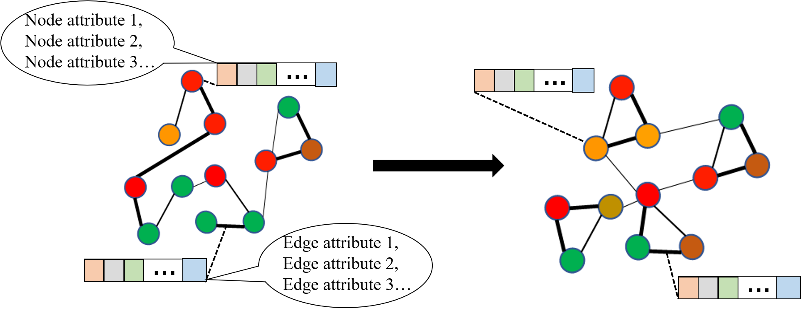

# Dataset-for-Deep-Graph-Translation
This page summarize and provide the data and applications for the deep graph translation problem. The deep graph translation problem aims to learn the mapping rules among graphs atomatically by oberving large amount of graph pairs based on the deep learning methods. There are two versions of deep graph translation problems: one is to learn a one-to-one mapping rule between the input graph and target graph, as the defination by Guo et al [1]; another is to learn a one-to-many mapping rule between the input graph and a set of target graphs, which is defined by Guo et al [2]; To avoid loss of generality, the graph in this problems can be all kinds of graphs, such as directed/undirected graphs, sign graphs, and multi-attributed graph. 

For wider investigation and explaration by researchers around the world, we provide five synthetic or real-world data as well as their application tasks for this problem: Scale-free graphs dataset, IoT (Internet of Things) dataset, Brainnetwork connectivety dataset, User authenticfication dataset, and the chemistry reaction dataset. 
    
    
## Scale-free Graphs 
Each input graph is generated as a directed scalefree network, which is a network whose degree distribution follows power-law property (Bollobas´ et al., 2003). To generate a target graph, a node will by selected as target node with probability proportional to its in-degree, which will be linked to a new source node with probability of 0.41. Similarly, a node will by selected as source node with probability proportional to its out-degree, which will be linked to a new target node with probability of 0.54. Then, a corresponding target graph is generated by adding m (m equals the number of nodes of the input graph) edges between two nodes. Thus, both input and target graphs are directed scale-free graphs. There are no node features in the dataset, and the goal is to learn the mapping from the input graphs' topology to the target graph's topology.

#### Content
There are five subsets of data with different graph size (i.e. number of nodes): 10, 20, 50, 100, and 150. In each subset, each graph pair (input and target graphs) are stored in the "index.csv" file. There are 2 tables in each file, first is the input graph and the second is the target graph. For each table, the value in i(th) comlume, j(th) row indicate whether there is an edge or not between Node i and Node j (1 indicating there is an edge and 0 otherwise).

#### Acknowledgements

## IoT 
## Brainnetwork  
## User Authetication
## Chemistry Reaction
